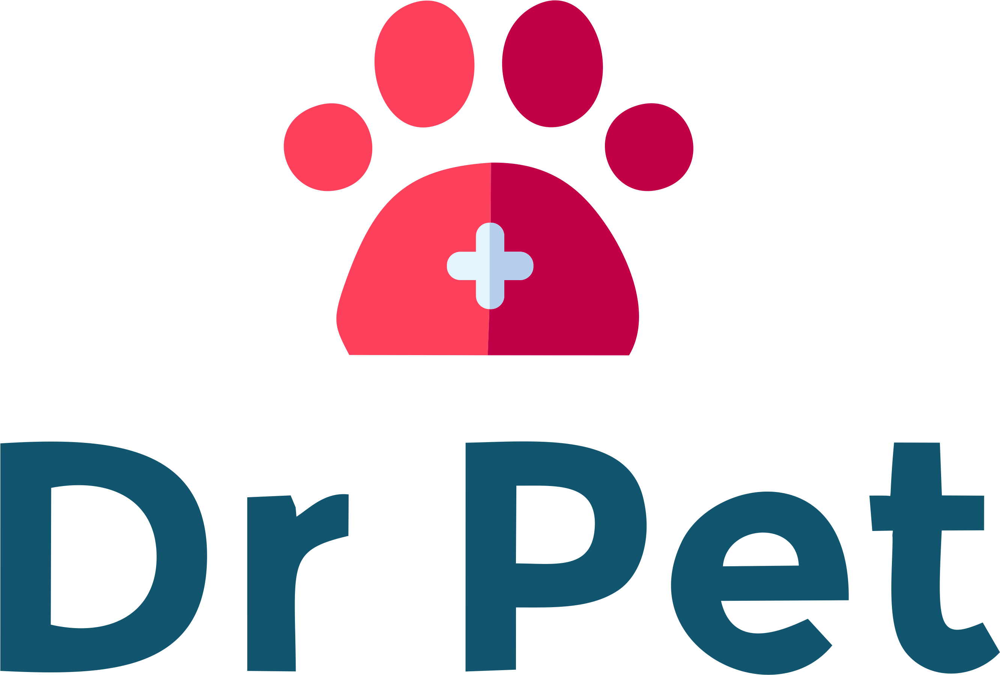

# DrPet 

DrPet es una aplicación web que permite gestionar los elementos básicos de una veterinaria. Desde mascotas, productos y adopciones.

---
## Instrucciones de instalación 

1. Clonar proyecto `git clone https://github.com/AlexDominguez1823/DrPet-SSPIS`
2. Cambiarse a directorio `cd DrPet-SSPIS` 
3. Instalar dependiencias mediante composer: `composer install`
4. Crear archivo de variables de entorno: `cp .env.example .env`
5. Crear llave: `php artisan key:generate`
6. Configurar nombre de base de datos en .env
7. Ejecutar las migraciones: `php artisan migrate`
8. Linkear storage con el public, para mostrar imágenes: `php artisan storage:link`

## Extra

- Tiene que tener instalado php.

Algunos comandos que pueden ser de utilidad para cargar las vistas por completo:
- npm install.

- npm run dev.

---

## Desarrollo
- Implementado con Laravel (v8)

*Derechos reservados.*
